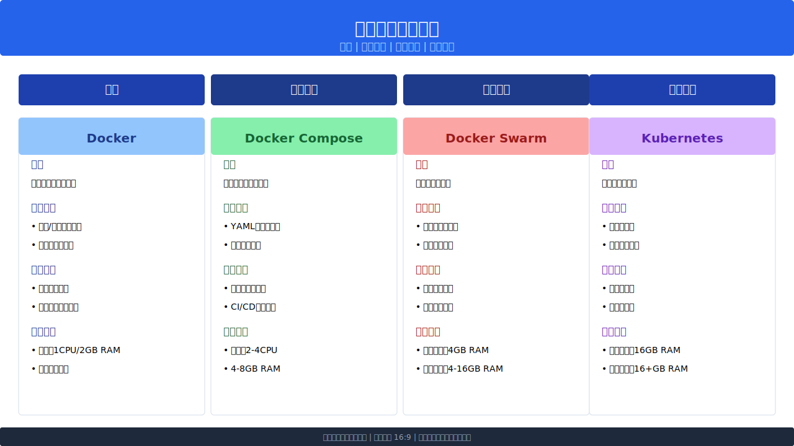
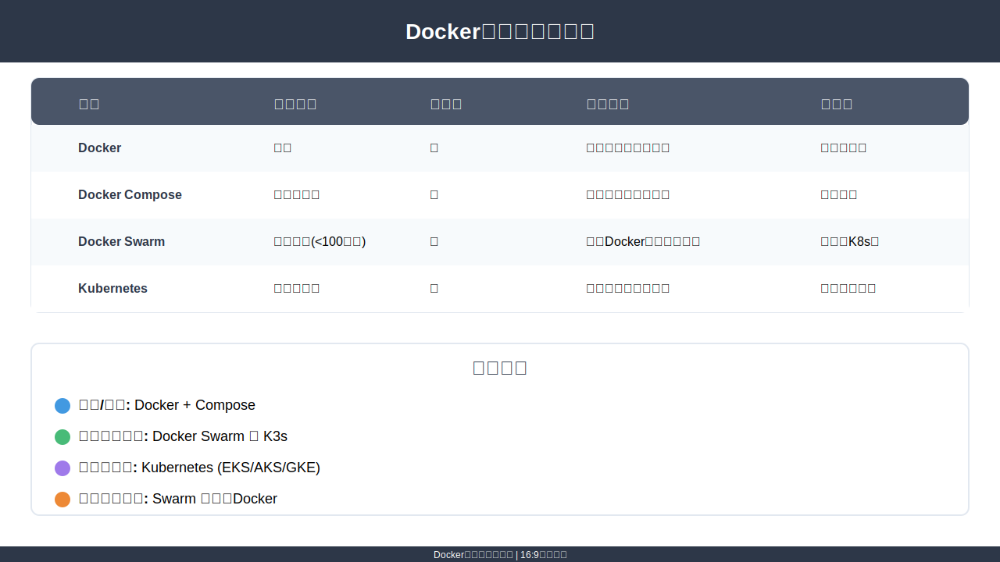

<!-- dddk 对比矩阵 -->
<!--  -->

<!-- dddk 对比指南、选择建议 -->


<!--  -->
<!--  -->

## Supported tags

- tags format 1: `{network-info}-{os-info}`
- tags format for default os: `{network-info}`
- tags format for default network: `{os-info}`

- network-info: cn,global
- os-info: alpine
- `cn-alpine`, `global-alpine`,
- `cn-alpine3.18`,`cn-alpine3.19`,`cn-alpine3.20`, `global-alpine3.18`,`global-alpine3.19`,`global-alpine3.20`,
- `global-alpine3.17`, `global-alpine3.18`, `global-alpine3.19`, `global-alpine3.20`
- `cn`, `global`
- `alpine`,`alpine3.17`, `alpine3.18`, `alpine3.19`, `alpine3.20`

## Deploy demo

### Docker CLI

```bash
# 拉取镜像
docker pull yemiancheng/mysql:cn-alpine3.18

# 运行容器
docker run -d --name mysql \
  -e MYSQL_ROOT_PASSWORD=yourpassword \
  -v /path/to/data:/var/lib/mysql \
  -p 3306:3306 \
  yemiancheng/mysql:cn-alpine3.18
```

### Docker Compose
```yaml
version: '3'
services:
  mysql:
    image: yemiancheng/mysql:cn-alpine3.18
    environment:
      MYSQL_ROOT_PASSWORD: yourpassword
    volumes:
      - /path/to/data:/var/lib/mysql
    ports:
      - "3306:3306"
```


### Kubernetes
```yaml
apiVersion: apps/v1
kind: Deployment
metadata:
  name: mysql
spec:
  replicas: 1
  template:
    spec:
      containers:
      - name: mysql
        image: yemiancheng/mysql:cn-alpine3.18
        env:
        - name: MYSQL_ROOT_PASSWORD
          value: "yourpassword"
        ports:
        - containerPort: 3306
        volumeMounts:
        - mountPath: /var/lib/mysql
          name: mysql-data
      volumes:
      - name: mysql-data
        persistentVolumeClaim:
          claimName: mysql-pvc
```

```bash
kubectl apply -f mysql-deployment.yaml
```

### Helm
```yaml
image:
  repository: yemiancheng/mysql
  tag: cn-alpine3.18
  pullPolicy: IfNotPresent

mysqlRootPassword: yourpassword

persistence:
  enabled: true
  storageClass: ""
  accessMode: ReadWriteOnce
  size: 8Gi

service:
  type: ClusterIP
  port: 3306
```

```bash
helm install mysql ./mysql-chart -f values.yaml
```

## Environment Variables
- get more in .env file.

## Data management
### Export data

```bash
docker exec -it mysql-container mysqldump -u root -p database > backup.sql
```

### Import data


```bash
docker exec -i mysql-container mysql -u root -p database < backup.sql
```

### Backup data

```bash
docker exec mysql-container mysqldump -u root -p database | gzip > backup.sql.gz
```

### Restore data

```bash
gunzip < backup.sql.gz | docker exec -i mysql-container mysql -u root -p database
```

## License

MIT License

Copyright (c) 2018-present Ye Miancheng <ymc.github@gmail.com>
